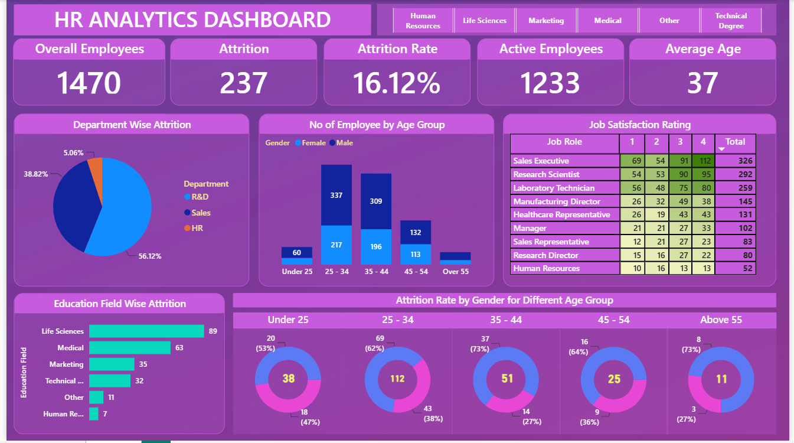

# 👥 HR Analytics Dashboard

## 📊 Dashboard Preview

### HR Analytics Dashboard

---

## 📌 Project Overview

This project focuses on analyzing employee data to understand
workforce trends, employee attrition, job satisfaction, and
employee demographics.

The dashboard was developed using Power BI, with data transformation
performed in Power Query and analysis using DAX.

---

## 🎯 Project Objectives

- Analyze the overall employee workforce
- Understand employee attrition
- Analyze the employee attrition rate
- Identify workforce trends by age and gender
- Analyze employee distribution across departments
- Understand job satisfaction
- Identify patterns in employee attrition

---

## 🛠️ Tools & Technologies

- Power BI
- Power Query
- DAX
- Excel / CSV

---

## 📈 Key Performance Indicators

| KPI | Value |
|---|---:|
| Total Employees | 1,470 |
| Attrition | 237 |
| Attrition Rate | 16.12% |
| Active Employees | 1,233 |
| Average Age | 37 |

---

## 🔍 Key Insights

- The organization has a total of 1,470 employees.
- 237 employees have left the organization.
- The overall employee attrition rate is 16.12%.
- Employees aged 25–34 represent the largest age group.
- R&D has the highest employee count among the departments.
- Employee attrition varies across different age groups and departments.
- Job satisfaction varies across different job roles.
- The dashboard provides an interactive view of employee demographics
  and attrition patterns.

---

## 📂 Project Files

| File | Description |
|---|---|
| `HR Analytics dashboard.pbix` | Power BI dashboard |
| `HR Data.csv` | HR employee dataset |
| `HR_Analytics_Dashboard.png` | Dashboard screenshot |

---

## 👨‍💻 Skills Demonstrated

- Data Cleaning
- Data Transformation
- Power Query
- Data Modeling
- DAX Measures
- KPI Development
- Interactive Dashboard Design
- HR Analytics
- Employee Attrition Analysis
- Data Visualization
- Business Insights
